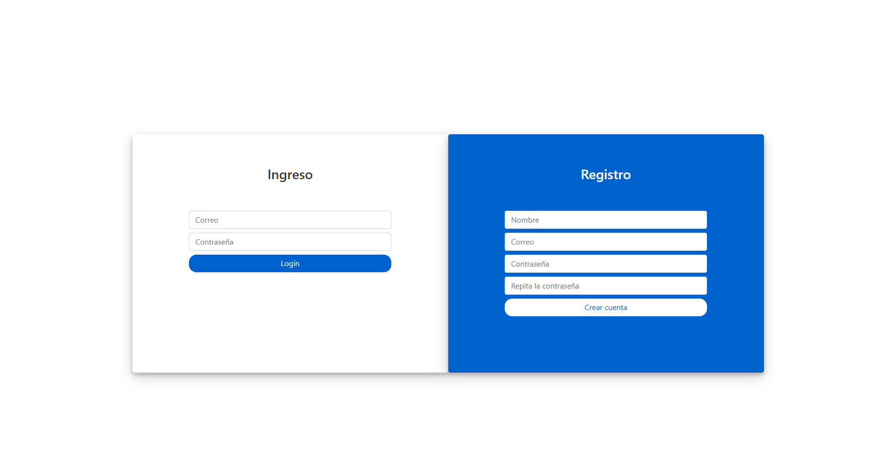
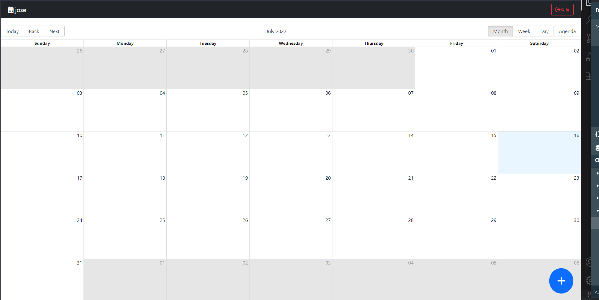
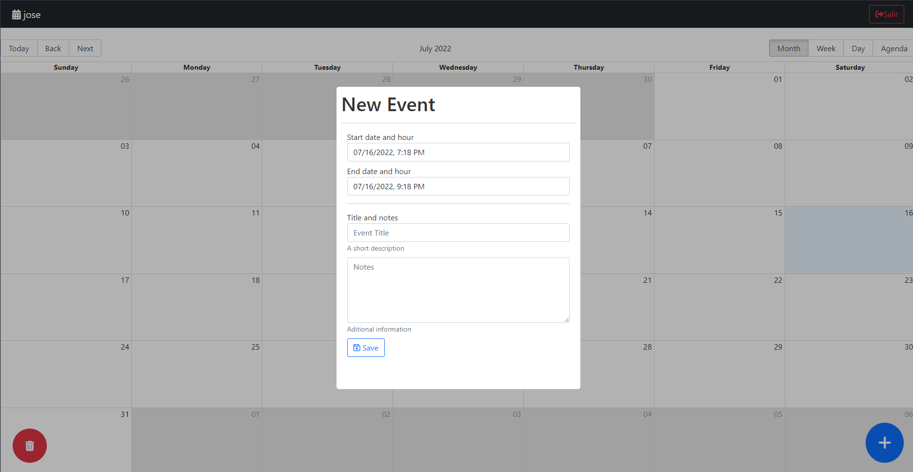
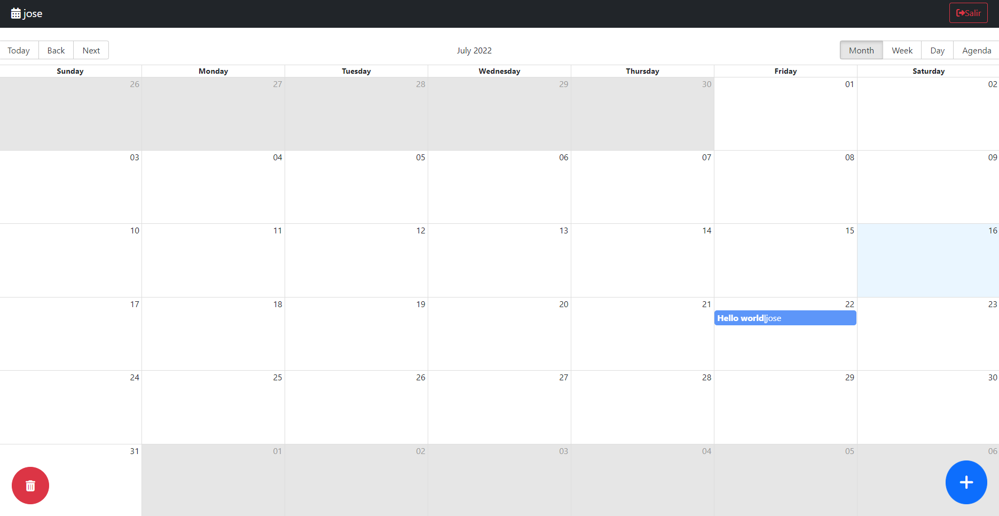

# A React Group Calendar

You an other can use the same calendar, add events, but you can delete only your events not the other events.

## Front End, Used Technologies:

React, Redux Toolkit, Axios, Date FNS, React Big Calendar, React Date Picker, React Modal, Sweet Alert 2, Git

## Back End used techologies:
Node.js, Express, Express Validator, MongoDB, Mongoose, Postman, Git, Bcrypt.js, JsonWebToken, Moment.

## Screenshots

### Login / Register

### Home

### Create Event

### Event Added

